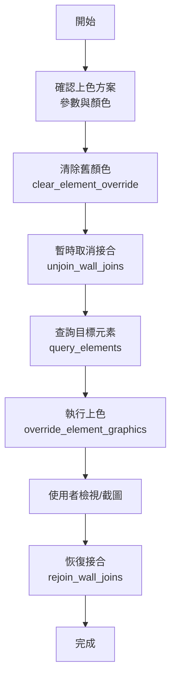

# 元素上色工作流程

## 📋 概述

本工作流程說明如何利用 MCP 工具 (`override_element_graphics`) 對 Revit 元素進行視覺化上色。此流程特別適用於防火時效檢討、法規檢討或區域視覺化。

**核心目標：** 透過顏色覆寫，直觀地展示元素的屬性狀態。

## 🎯 適用場景

- 防火防煙與耐燃等級視覺化
- 牆體類型分色圖
- 施工階段標記
- 結構構件材質分色

## 🔧 核心工具

### 1. override_element_graphics
**用途：** 覆寫單一或多個元素的圖形顯示（顏色、圖樣、透明度）。

**輸入參數範例：**
```json
{
  "elementId": 123456,
  "viewId": 987654,
  "surfaceFillColor": { "r": 255, "g": 0, "b": 0 },  // 紅色
  "surfacePatternId": -1,  // -1 表示實心填滿 (Solid Fill)
  "transparency": 0
}
```

### 2. unjoin_wall_joins / rejoin_wall_joins
**用途：** 暫時取消牆柱接合，避免顏色被相鄰元素遮擋或混合。
**重要性：** Revit 預設會將相交的牆體融合，導致上色邊界模糊。為了獲得清晰的視覺化結果，必須在上色前 `Unjoin`，截圖或檢視完成後 `Rejoin`。

### 3. clear_element_override
**用途：** 清除圖形覆寫，恢復原始顯示狀態。

---

## 🔄 標準工作流程



### 步驟 1：確認上色方案
與用戶確認要依據哪個參數進行分類，以及對應的顏色。

**範例方案（防火時效）：**
| 參數值 | 顏色 | RGB |
|:-------|:-----|:----|
| 60 分鐘 | 🔴 紅色 | (255, 0, 0) |
| 120 分鐘 | 🟡 黃色 | (255, 255, 0) |
| 180 分鐘 | 🟢 綠色 | (0, 128, 0) |
| 柱子 | ⚫ 黑色 | (0, 0, 0) |

### 步驟 2：清除舊顏色
在上色前，確保視圖乾淨，清除殘留的覆寫。

```javascript
// 清除整個視圖的覆寫
executeRevitTool('clear_element_override', { 
    elementIds: [/* 所有目標元素 ID */] 
});
```

### 步驟 3：暫時取消接合 (Unjoin)
為確保牆體顏色邊界清晰，必須暫時取消接合。

```javascript
executeRevitTool('unjoin_wall_joins', { 
    elementIds: [/* 所有目標牆 ID */] 
});
```

### 步驟 4：執行上色
根據查詢到的元素屬性，逐一或批次執行上色。

```javascript
// 範例：將元素 123456 塗成紅色
executeRevitTool('override_element_graphics', { 
    elementId: 123456,
    surfaceFillColor: { r: 255, g: 0, b: 0 },
    surfacePatternId: -1 // 實心
});
```

### 步驟 5：恢復接合 (Rejoin)
檢視完成後，務必恢復牆體接合，以免影響後續建模與出圖。

```javascript
executeRevitTool('rejoin_wall_joins', { 
    elementIds: [/* 所有目標牆 ID */] 
});
```

---

## ⚠️ 注意事項

1. **視圖專屬性 (View-Specific)**
   - `override_element_graphics` 只影響**當前視圖** (Current View)。
   - 不會改變元素的材質或全域設定。

2. **圖樣類型 (Pattern Type)**
   - **平面圖**：通常覆寫 `CutPattern` (剖面填充)。
   - **立面/3D視圖**：通常覆寫 `SurfacePattern` (表面填充)。
   - 目前工具參數 `surfacePatternId` 主要控制表面/投影圖樣，若需控制切面圖樣，需確認 API 支援程度。
   - 設為 `-1` 通常代表實心填滿 (Solid Fill)。

3. **效能考量**
   - 批次上色時，建議將多個操作合併為一次 `execute_command` 呼叫（若工具支援批次 ID），或分批處理以免超時。
   - `unjoin` 與 `rejoin` 操作較耗時，僅針對需要上色的牆體執行即可。

4. **柱子上色**
   - 結構柱通常不參與牆體接合，但為了圖面清晰，常規會將其塗黑以便識別。

---

## 📚 相關工具索引

- [query_elements](tool:query_elements) - 查詢元素以取得參數值
- [override_element_graphics](tool:override_element_graphics) - 執行上色
- [unjoin_wall_joins](tool:unjoin_wall_joins) - 處理接合
- [rejoin_wall_joins](tool:rejoin_wall_joins) - 恢復接合

---

**最後更新：** 2026-02-02  
**維護者：** RevitMCP Team
